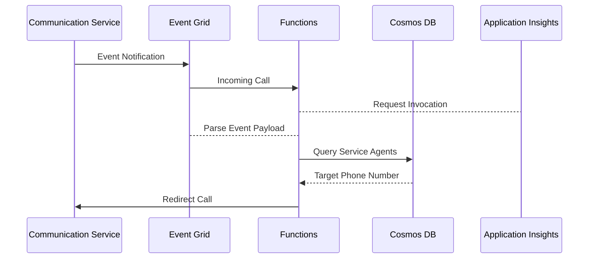
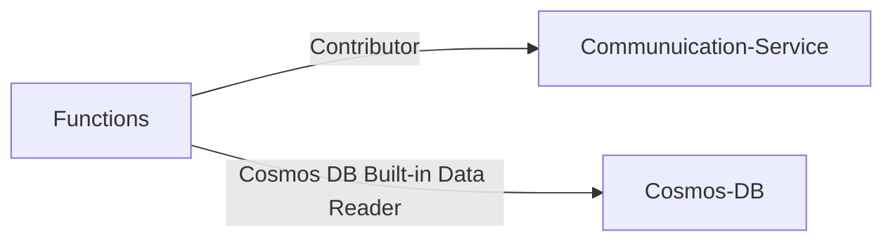

# Call Handler

This repository helps you connect Azure Communication Service with incoming call handling and routing to available Service Agents. We've created a routing system using Azure Communication Service, Event Grid, Azure Functions, and Cosmos DB.

For more complex situations, consider using Azure Communication Service's Job Router feature.

_Please note these artifacts are under development and subject to change._

## Guides

- [Getting Started](./docs/README.md#getting-started)

## Architecture

### Process Flow

### Identity Design

