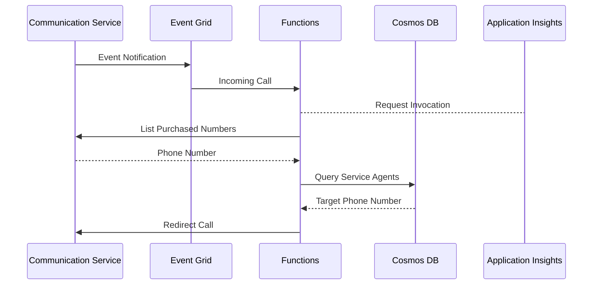

# Call Handler

This repository helps you connect Azure Communication Service with incoming call handling and routing to available Service Agents. We've created a routing system using Azure Communication Service, Event Grid, Azure Functions, and Cosmos DB.

For more complex situations, consider using Azure Communication Service's [Job Router](https://learn.microsoft.com/azure/communication-services/concepts/router/concepts) feature.

_Please note these artifacts are under development and subject to change._

## Architecture



## Getting Started

Add extensions

```bash
az extension add --name communication
az extension add --name application-insights
```

Deploy resources

```bash
# Communication Service
az communication create \
    --name '' \
    --resource-group '' \
    --location global \
    --data-location ''

# Storage Account
az storage account create \
    --name '' \
    --resource-group '' \
    --location global \
    --sku Standard_LRS \
    --kind StorageV2

# Log Analytics
az monitor log-analytics workspace create \
    --name '' \
    --resource-group '' \
    --location ''

# Application Insights
az monitor app-insights component create \
    --app '' \
    --resource-group '' \
    --location '' \
    --kind web \
    --workspace ''

# Cosmos DB
az cosmosdb create \
    --name '' \
    --resource-group '' \
    --locations regionName='' \
    --capabilities EnableServerless

# Cosmos DB (Database)
az cosmosdb sql database create `
    --account-name '' `
    --resource-group '' `
    --name Agents

# Cosmos DB (Container)
az cosmosdb sql container create `
    --account-name '' `
    --resource-group '' `
    --database-name '' `
    --partition-key-path "/serviceId" `
    --name Items

# Functions
az functionapp create \
    --name '' \
    --resource-group '' \
    --consumption-plan-location '' \
    --os-type 'Linux' \
    --functions-version 4 \
    --runtime 'node' \
    --runtime-version '18' \
    --storage-account '' \
    --app-insights '' \
    --assign-identity

# Functions (Configuration)
# - COMMUNICATION_ENDPOINT=https://{}.{}.communication.azure.com
# - COSMOS_ENDPOINT=https://{}.documents.azure.com
# - COSMOS_DATABASE={}
# - COSMOS_CONTAINER={}
az functionapp config appsettings set \
    --name '' \
    --resource-group '' \
    --settings ''

# Event Grid
az eventgrid event-subscription create \
    --name 'default' \
    --source-resource-id '' \
    --endpoint 'https://{}.azurewebsites.net/api/callHandler'

# Role Assignment
# Functions (Identity) -> Communication Service
az role assignment create \
    --assignee '{}' \
    --role Contributor \
    --scope {}> Replace

# Role Assignment
# Functions (Identity) - Cosmos DB
az cosmosdb sql role assignment create \
    --account-name '' \
    --resource-group '' \
    --scope "/" \
    --principal-id '' \
    --role-definition-id '00000000-0000-0000-0000-000000000001'
```

Sample data

```json
{
    "id": "",
    "/serviceId": "",
    "fullName": "",
    "phoneNumber": "",
    "status": "available"
}
```
